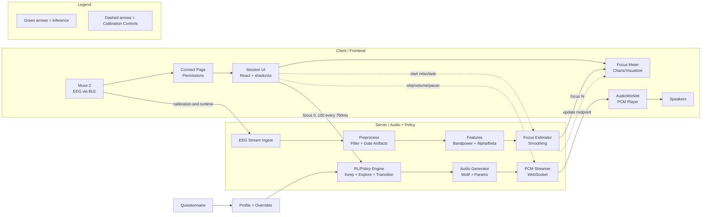
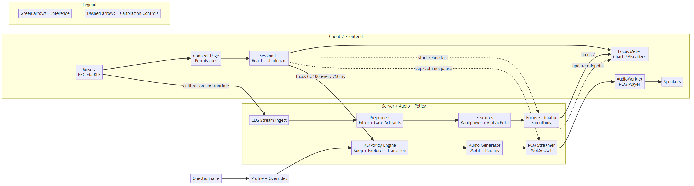

# MUSYNC Stack Diagram

Mermaid source and PNG export for the app stack (client/server, runtime only — no offline datasets).

Preferred (crisp):
- 

PNG export (hi‑res):
- 

Export locally
- Quick PNG (hi‑res): `cd app/frontend && npx -y @mermaid-js/mermaid-cli@^10.9.1 -i ../../docs/stack-diagram.mmd -o ../../docs/stack-diagram.png -w 2400 -H 1600 -b white`
- Quick SVG (sharp at any zoom): `cd app/frontend && npx -y @mermaid-js/mermaid-cli@^10.9.1 -i ../../docs/stack-diagram.mmd -o ../../docs/stack-diagram.svg`
- With scripts: install once `npm i -D @mermaid-js/mermaid-cli` in `app/frontend`, then:
  - `npm run diagram:stack` (PNG hi‑res)
  - `npm run diagram:stack:svg` (SVG)

